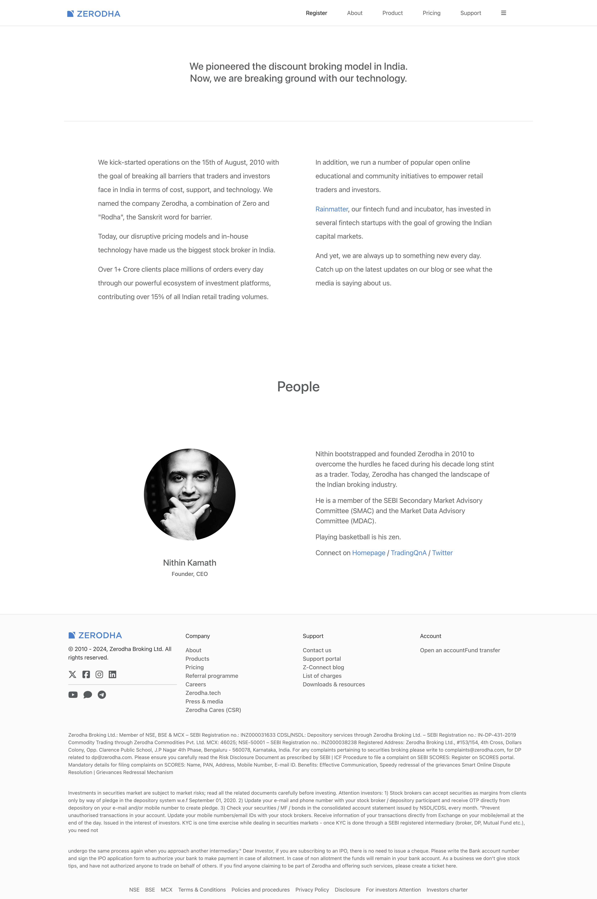

# 🌐 Zerodha Clone

Welcome to Zerodha! This is a full-stack MERN-based clone of the popular stock trading platform Zerodha, with extended functionalities like dashboard.

---
## LINK :
Frontend  - https://tradexa-dashboard.onrender.com
Dashboard - https://tradexa-dashboard-main.onrender.com

## 📑 Table of Contents

* [Technologies](#-technologies)
* [Packages & Libraries Used](#-packages--libraries-used)
* [Getting Started](#-getting-started)
* [Setup](#️-setup)
* [Features](#-features)
* [Demo & Screenshots](#-demo--screenshots)
* [Acknowledgments](#-acknowledgments)
* [License](#-license)

---


## 💻 Technologies

### 🌐 Web

* React.js
* Node.js
* MongoDB
* Express.js

---

## 📦 Packages / Libraries Used

| Package / Library      | Purpose                       |
| ---------------------- | ----------------------------- |
| Bootstrap 5.3          | Responsive design             |
| Tailwind CSS + DaisyUI | Theme and UI customization    |
| Material UI            | UI Components                 |
| Express.js             | Backend framework             |
| Mongoose               | MongoDB object modeling       |
| Bcrypt                 | Password hashing              |
| JWT                    | Authentication tokens         |
| Chart.js               | Chart visualizations          |
| Axios                  | HTTP client                   |
| React Router DOM       | Client-side routing           |
| Passport               | Authentication                |
| cors                   | Cross-origin requests         |
| Body-Parser            | Middleware for request bodies |

---

## 🚀 Getting Started

### Clone the repository

```bash
git clone https://github.com/gauravag18/TRADEXA-ZERODHA-CLONE-.git
```

### Install dependencies

Install dependencies separately for each module.

```bash
# Backend
cd backend
npm install

# Dashboard
cd ../dashboard
npm install

# Frontend
cd ../frontend
npm install
```

### Set up environment variables

Create a `.env` file in the `backend` directory with the following:

```
PORT=5000
MONGO_URL=your_mongodb_connection_string
secret=your_jwt_secret
```

### Run the app

Start backend, frontend, and dashboard separately:

```bash
# Backend
cd backend
npm start

# Dashboard
cd ../dashboard
npm start

# Frontend
cd ../frontend
npm start
```

---

## ⚙️ Setup

* Visit: `http://localhost:3000/`
* Register or login as a user
* Navigate through the Dashboard, Profile, Orders, and Chat
* Interact with real-time features and customize themes

---

## 🎯 Features

* ✅ Full User Authentication
* 📊 Interactive Dashboard with Charts
* 📈 Orders, Products, Pricing Pages
* 🚀 Seamless Routing with React Router

---

## 🔗 Demo & Screenshots

### 🧪 Demo Credentials

**Username**: `Demo Account`
**Password**: `demo@123`
**Email-ID**: `demo@gmail.com`

### 📷 Mockups

### Home Page


### Dashboard Page


### About Page



## 📜 License

This project is licensed under the **MIT License**. See the [LICENSE](LICENSE) file for more information.

---

> Enjoy exploring and contributing to **TRADEXA – Zerodha Clone**!
> Feel free to fork, star ⭐ and raise issues or PRs 🙌
